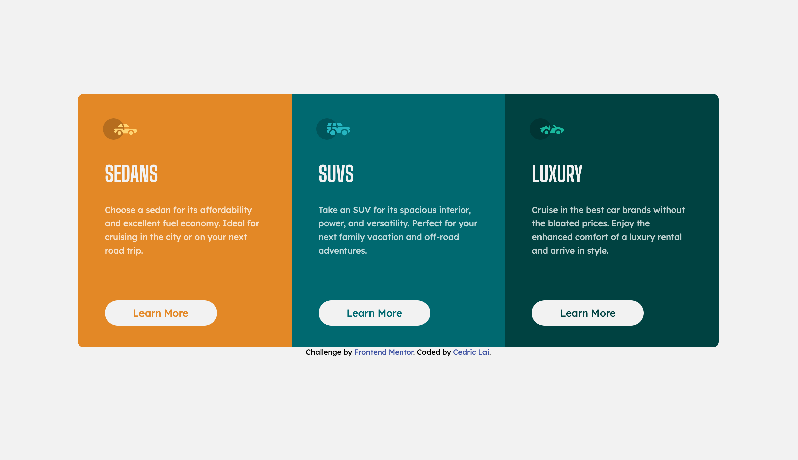

# Frontend Mentor - 3-column preview card component solution

This is a solution to the [3-column preview card component challenge on Frontend Mentor](https://www.frontendmentor.io/challenges/3column-preview-card-component-pH92eAR2-). Frontend Mentor challenges help you improve your coding skills by building realistic projects.

## Screenshot

### Desktop

### Mobile

## Links

- Solution URL: [Add solution URL here](https://your-solution-url.com)
- Live Site URL: [Github Pages](https://lamberor.github.io/stats-preview-card-component/)

## Built with

- Semantic HTML5 markup
- SASS
- Flexbox
- Mobile-first workflow
